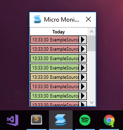
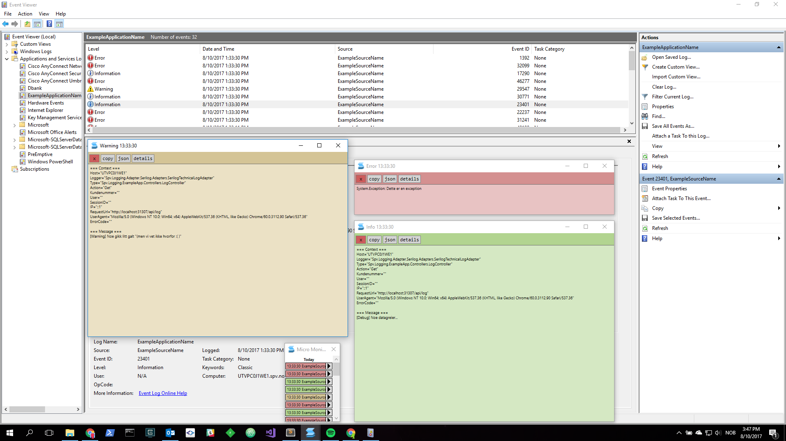
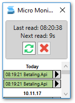
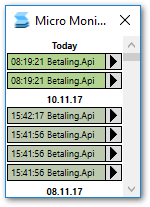

# Micro Monitor

> The tiniest Event Log reader for Windows

_Absolutely minimal so it can be open all day without being in the way_

_Quickly read an event by clicking on the log entry or holding SHIFT and moving the mouse across each log entry in the list_

_Open several events at once by clicking the arrow button at each log entry_

_MicroMonitor polls the event log on the given interval (10 secs by default). Hold <kbd>E</kbd> to inspect the last poll time and manually trigger a refresh_

_Colors stale (old) log entries (configurable colors and stale threshold in config)_

_Configure it through `MicroMonitor.exe.config`_

Most settings can be adjusted in [the config](https://github.com/eaardal/MicroMonitor/blob/master/MicroMonitor/App.config)

| Key																					| Action
|---------------------------------------------------------------------------------------|-------------------
| <kbd>E</kbd>																			| Toggle info panel
| <kbd>R</kbd> OR <kbd>Left Ctrl</kbd>+<kbd>R</kbd>										| Refresh events
| Hold <kbd>Left Shift</kbd> and mouse over log entries									| Open log entry under the mouse in Peek Window
| <kbd>Left Mouse Click</kbd>															| Open log entry in Peek Window
| <kbd>Right Mouse Click</kbd>															| Open log entry in a full screen Peek Window
| <kbd>Left Ctrl</kbd>+<kbd>Left Mouse Click</kbd>										| Open log entry in a new Detail Window
| <kbd>W</kbd> OR <kbd>Up Arrow</kbd>													| Traverse up and open log entry in Peek Window
| <kbd>Left Ctrl</kbd>+<kbd>W</kbd> OR <kbd>Left Ctrl</kbd>+<kbd>Up Arrow</kbd>			| Traverse up and open log entry in new Detail Window
| <kbd>Left Shift</kbd>+<kbd>W</kbd> OR <kbd>Left Shift</kbd>+<kbd>Up Arrow</kbd>		| Traverse up and open log entry in a full screen Peek Window
| <kbd>S</kbd> OR <kbd>Down Arrow</kbd>													| Traverse down and open log entry in Peek Window
| <kbd>Left Ctrl</kbd>+<kbd>S</kbd> OR <kbd>CTRL</kbd>+<kbd>Down Arrow</kbd>			| Traverse down and open log entry in new Detail Window
| <kbd>Left Shift</kbd>+<kbd>S</kbd> OR <kbd>Left Shift</kbd>+<kbd>Down Arrow</kbd>		| Traverse down and open log entry in a full screen Peek Window
| <kbd>1</kbd>-<kbd>9</kbd>																| Open log entry `{nr}` in Peek Window
| <kbd>Left Ctrl</kbd>+<kbd>1</kbd>-<kbd>9</kbd>										| Open log entry `{nr}` in a new Detail Window
| <kbd>Left Shift</kbd>+<kbd>1</kbd>-<kbd>9</kbd>										| Open log entry `{nr}` in a full screen Peek Window

