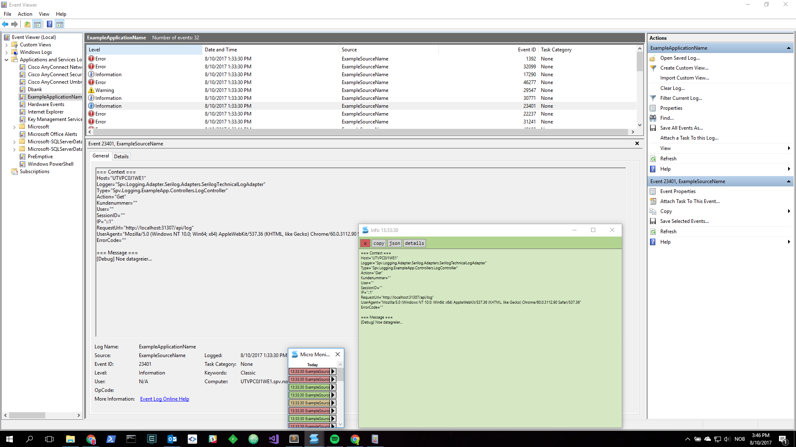

# Micro Monitor

> The tiniest Event Log reader

_Absolutely minimal so it can be opened all day without being in the way_

_Quickly read an event by clicking on the log entry or holding SHIFT and moving the mouse across each log entry in the list_

_Open several events at once by clicking the arrow button at each log entry_

_MicroMonitor polls the event log on the given interval (10 secs by default). Hold CTRL to inspect the last poll time and manually trigger a refresh_

_Configure it through `MicroMonitor.exe.config`_

Most settings can be adjusted in [the config](https://github.com/eaardal/MicroMonitor/blob/master/MicroMonitor/App.config)